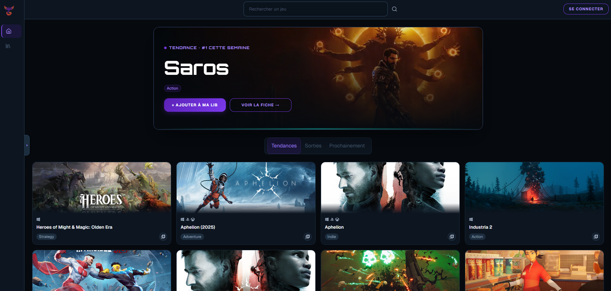
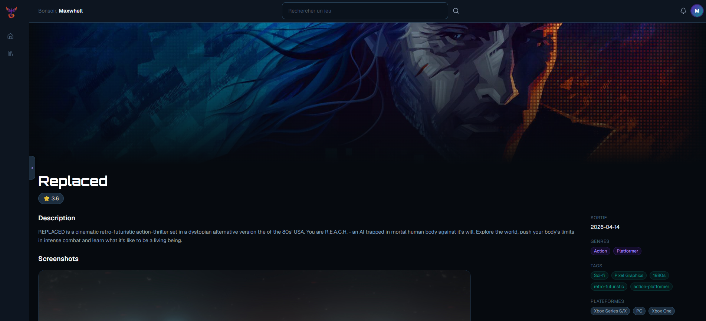
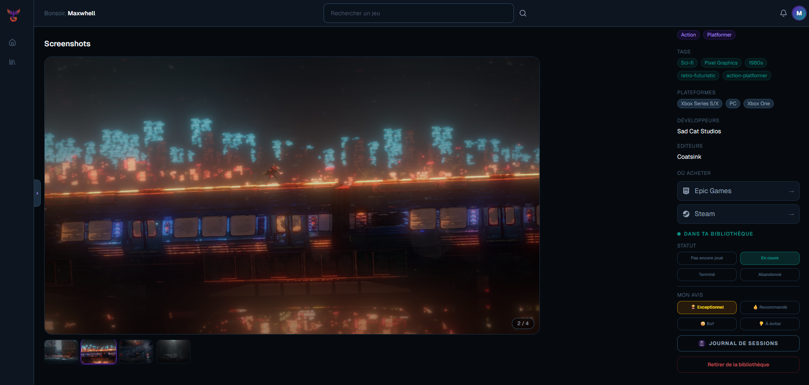
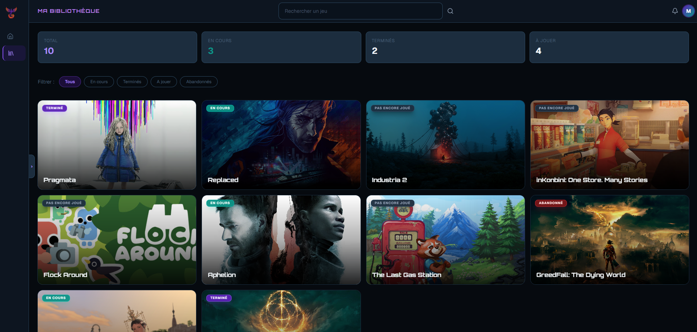
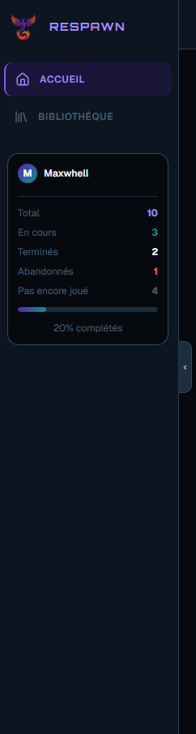
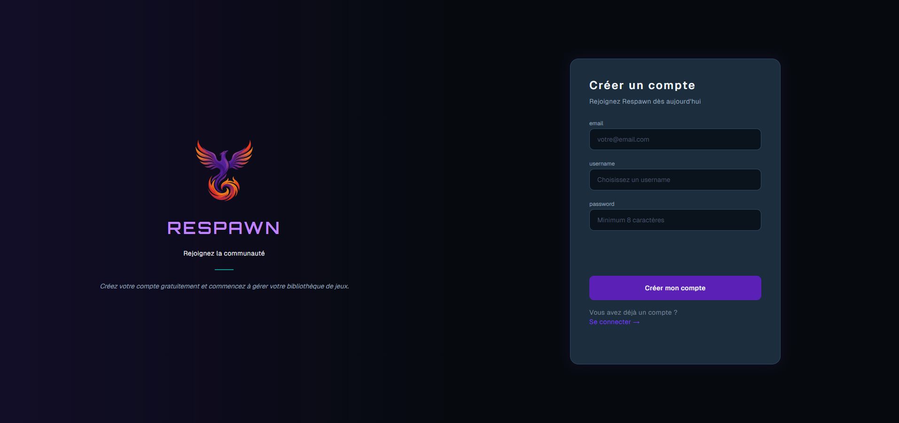

# 🎮 Respawn — Frontend

> A premium gaming library hub inspired by Steam, RAWG, and MyLudo. Browse games, manage your personal library, track your sessions, and rate what you play.

**Live Demo:** [respawn-frontend-roan.vercel.app](https://respawn-frontend-roan.vercel.app)  
**Backend Repo:** [github.com/Maxime-Maguet/respawn-backend](https://github.com/Maxime-Maguet/respawn-backend)

---

## 📸 Screenshots

### Home Screen



### Game Screen




### Library Screen



### Sidebar



### Sign Up



---

## ✨ Features

- **Browse games** — Trending, recent releases, and upcoming titles powered by the RAWG API
- **Hero Banner** — Featured #1 trending game with cinematic display
- **Game Search** — Real-time search across 500,000+ games
- **Game Detail Page** — Full metadata: description, screenshots carousel, genres, tags, platforms, developers, publishers, stores (Steam, Epic, PlayStation, Xbox, Nintendo)
- **Personal Library** — Add, remove, and manage your game collection
- **Status Tracking** — Playing, Completed, Abandoned, Not Yet Played
- **Rating System** — Exceptional, Recommended, Meh, Skip
- **Session Journal** — Log your gaming sessions with notes
- **Library Stats** — Visual stats with progress bar (total, playing, completed, abandoned)
- **Collapsible Sidebar** — Expandable sidebar with live library statistics
- **Authentication** — Secure signup/signin with JWT, persisted via Redux
- **Toast Notifications** — Feedback on library actions
- **Responsive Dark Theme** — Premium dark navy UI with violet/teal accents

---

## 🛠 Tech Stack

| Category         | Technology                         |
| ---------------- | ---------------------------------- |
| Framework        | React 19 + Vite                    |
| Styling          | Tailwind CSS v4                    |
| State Management | Redux Toolkit + redux-persist      |
| Server State     | TanStack Query v5                  |
| HTTP Client      | Axios (with JWT interceptor)       |
| Routing          | React Router v7                    |
| Animations       | Framer Motion                      |
| Icons            | Lucide React + React Icons         |
| Notifications    | Sonner                             |
| Fonts            | Orbitron (headings) + Inter (body) |

---

## 🚀 Getting Started

### Prerequisites

- Node.js 18+
- A running instance of the [Respawn Backend](https://github.com/Maxime-Maguet/respawn-backend)

### Installation

```bash
git clone https://github.com/Maxime-Maguet/respawn-frontend.git
cd respawn-frontend
npm install
```

### Environment Variables

Create a `.env` file at the root:

```env
VITE_API_URL=http://localhost:3000
```

### Run

```bash
npm run dev
```

---

## 📁 Project Structure

```
src/
├── api/          # Axios API calls (auth, game, library)
├── assets/       # Images and static assets
├── components/
│   ├── auth/     # ProtectedRoute, AuthModal
│   ├── game/     # GameCard, LibraryCard, JournalModal, ConfirmModal
│   ├── layout/   # Layout, SideBar, TopBar
│   └── ui/       # Button, Card, Input, ErrorBox
├── pages/        # HomeScreen, GameScreen, LibraryScreen, SigninScreen, SignupScreen
└── redux/        # Store, slices (userSlice)
```

---

## 🌐 Deployment

Deployed on **Vercel** with automatic deployments on push to `main`.

Environment variable set in Vercel dashboard:

```
VITE_API_URL=https://respawn-backend-ajr6.onrender.com
```

---

## 👤 Author

**Maxime Maguet** — Fullstack JS Developer  
RNCP Level 6 — La Capsule Bootcamp (Batch 194, April 2026)

[](https://github.com/Maxime-Maguet)
